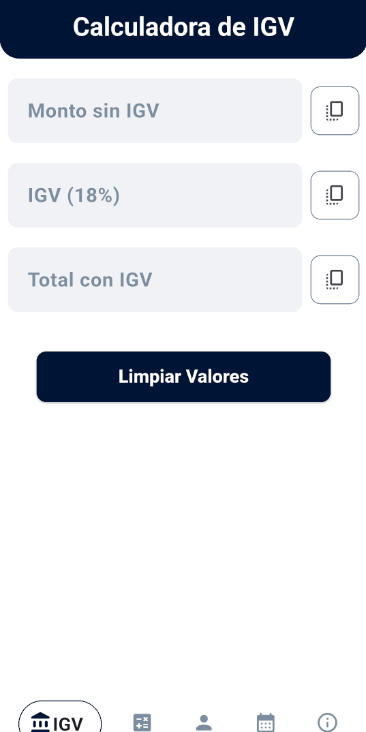
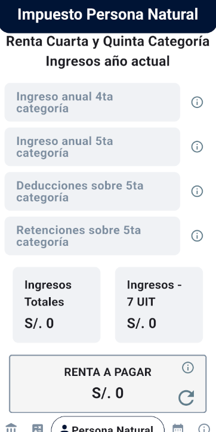
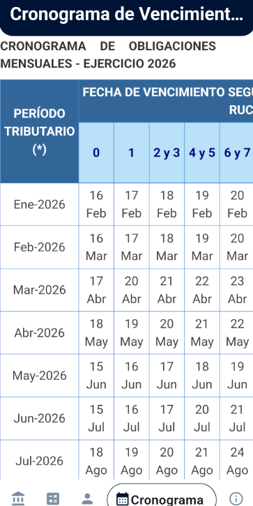

# Calculadora IGV - Renta

Aplicación móvil desarrollada con Flutter para facilitar el cálculo de impuestos peruanos como el IGV (Impuesto General a las Ventas), las obligaciones del Nuevo RUS (Régimen Único Simplificado) y el Régimen Especial de Renta (RER). Además, integra una visualización del cronograma oficial de obligaciones mensuales de la SUNAT.

## Características Principales

*   **Cálculo de IGV:**
    *   Calcula el IGV y el monto total a partir de un monto base.
    *   Permite desglosar el IGV, obteniendo el monto base y el impuesto a partir de un monto total.
*   **Cálculo de Impuesto - Nuevo RUS:**
    *   Determina la cuota mensual del Nuevo RUS según los ingresos o compras del contribuyente.
*   **Cálculo de Impuesto - Régimen Especial de Renta (RER):**
    *   Calcula el impuesto a la renta (1.5% sobre los ingresos netos mensuales).
    *   Calcula el IGV correspondiente asociado a este régimen.
*   **Cronograma de Obligaciones Mensuales SUNAT:**
    *   Muestra el cronograma oficial de vencimientos para la declaración y pago de impuestos directamente desde la página de la SUNAT a través de un WebView. Esto asegura que la información esté siempre actualizada por la fuente oficial.
*   **Valor de la UIT:**
    *   Utiliza el valor actualizado de la Unidad Impositiva Tributaria (UIT) para los cálculos que lo requieran. (Nota: El valor de la UIT se actualiza manualmente en la aplicación de forma periódica, usualmente al inicio de cada año fiscal).

## Capturas de Pantalla (Próximamente)

## Tecnologías Utilizadas

*   **Framework:** Flutter
*   **Lenguaje:** Dart
*   **Manejo de Estado:** Provider
*   **Componentes Nativos:** WebView (para el cronograma de SUNAT)

## Uso Previsto

Esta aplicación está diseñada para ayudar a contribuyentes, pequeños empresarios y cualquier persona en Perú que necesite realizar cálculos tributarios rápidos y acceder al cronograma de obligaciones de manera sencilla.

**Nota Importante:** Si bien esta aplicación busca ser una herramienta útil, los cálculos y la información proporcionada deben ser tomados como una referencia. Siempre es recomendable consultar con un profesional contable o verificar directamente con las normativas vigentes de la SUNAT para tomar decisiones financieras o fiscales. La actualización manual del valor de la UIT es responsabilidad del desarrollador y se realiza periódicamente.